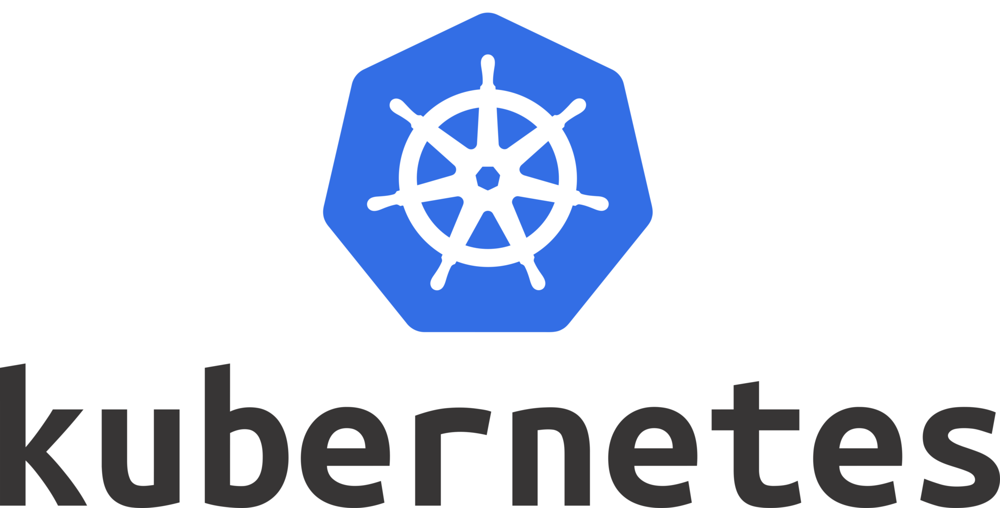

کوبرنتیز یک پلتفرم برای مدیریت بارهای کاری کانتینری و سرویس‌ها است که در اصل به منظور خودکارسازی استقرار، مقیاس‌بندی و عملیات کانتینرها طراحی شده است. با استفاده از کوبرنتیز، می‌توان به صورت کارآمدی تعداد زیادی کانتینر را بر روی کلاسترهای (خوشه‌های) فیزیکی یا مجازی مدیریت کرد.

<!--truncate-->
## کوبرنتیز چیست؟
کوبرنتیز یک پلتفرم برای مدیریت بارهای کاری کانتینری و سرویس‌ها است که در اصل به منظور خودکارسازی استقرار، مقیاس‌بندی و عملیات کانتینرها طراحی شده است. با استفاده از کوبرنتیز، می‌توان به صورت کارآمدی تعداد زیادی کانتینر را بر روی کلاسترهای (خوشه‌های) فیزیکی یا مجازی مدیریت کرد.

### **مزایای استفاده از کوبرنتیز**
1. **خودکارسازی استقرار و مدیریت کانتینرها:** کوبرنتیز به شما این امکان را می‌دهد که به راحتی کانتینرها را استقرار دهید، به‌روزرسانی کنید و در صورت نیاز آن‌ها را حذف کنید. این امر باعث می‌شود که فرآیندهای زمان‌بر و پیچیده مدیریت کانتینرها به سادگی انجام شود و کارایی و بهره‌وری تیم‌ها افزایش یابد.
2. **مقیاس‌پذیری افقی:** کوبرنتیز به شما اجازه می‌دهد تا به صورت خودکار تعداد کانتینرهای در حال اجرا را بر اساس نیازهای بار کاری افزایش یا کاهش دهید. این مقیاس‌پذیری به شما امکان می‌دهد منابع خود را بهینه‌سازی کرده و هزینه‌ها را کاهش دهید.
3. **ایجاد تعادل (Load Balancer):**
کوبرنتیز می‌تواند ترافیک شبکه را به‌طور خودکار بین کانتینرها متعادل کند تا سرعت و کارایی برنامه با افزایش یا کاهش بار حفظ شود. همچنین، با استفاده از نام DNS یا آدرس IP، دسترسی به کانتینرها را تسهیل می‌کند. این ویژگی به شما کمک می‌کند تا خدمات خود را با کیفیت بالا و بدون اختلال ارائه دهید.
4. **مدیریت ذخیره‌سازی:**
 کوبرنتیز از انواع مختلف سیستم‌های ذخیره‌سازی پشتیبانی می‌کند و به شما این امکان را می‌دهد تا به صورت پویا منابع ذخیره‌سازی را به کانتینرها اختصاص دهید. این انعطاف‌پذیری در مدیریت ذخیره‌سازی به شما کمک می‌کند تا بهره‌وری منابع را افزایش داده و هزینه‌های ذخیره‌سازی را بهینه کنید.
5. **خودترمیمی:**
کوبرنتیز کانتینرهای دچار خطا را ری‌استارت و جایگزین می‌کند و مواردی را که بر اساس وضعیت دلخواه کاربر نیستند، خاتمه می‌دهد. همچنین، کانتینرهایی که به درستی کار نمی‌کنند را تا زمانی که بهبود نیابند، به کلاینت ارسال نمی‌کند. این ویژگی باعث می‌شود سیستم به طور خودکار ترمیم شود و همیشه در دسترس باشد.

### **اجزای کلیدی کوبرنتیز**
- **کلاستر (Cluster):** کلاستر کوبرنتیز مجموعه‌ای از ماشین‌های فیزیکی یا مجازی است که وظیفه اجرای برنامه‌های کانتینری را بر عهده دارند. این کلاسترها به صورت همزمان با هم کار می‌کنند تا بارهای کاری را به صورت توزیع شده مدیریت کنند و از این طریق از منابع بهینه استفاده کنند.
- **گره (Node):** هر کلاستر از چندین گره تشکیل شده است که هر کدام شامل یک ماشین فیزیکی یا مجازی هستند. گره‌ها مسئول اجرای پادها هستند و با همدیگر همکاری می‌کنند تا بارهای کاری را بهینه‌سازی کنند.
- **پاد (Pod):** پادها کوچکترین واحد اجرایی در کوبرنتیز هستند که می‌توانند یک یا چند کانتینر را شامل شوند و منابع مشترکی مانند شبکه و ذخیره‌سازی را به اشتراک بگذارند. پادها به عنوان یک واحد منطقی برای مدیریت و مقیاس‌بندی کانتینرها عمل می‌کنند.
- **Namespace:** به منظور تفکیک و مدیریت منابع درون کلاستر استفاده می‌شوند و امکان ایجاد محیط‌های جداگانه را برای توسعه و تولید فراهم می‌کنند.  نیم اسپیس به شما این امکان را می‌دهند که منابع مختلف را به صورت مجزا مدیریت کرده و از تداخل منابع جلوگیری کنید.
- **استقرار (Deployment):** یک شی که تکثیر و انتشار پادهای برنامه را در یک کلاستر مدیریت می‌کند. این اطمینان حاصل می‌کند که تعداد مورد نظر پاد در حال اجرا هستند و به‌روزرسانی‌ها و بازگشت‌ها را مدیریت می‌کند. استقرارها به شما کمک می‌کنند که برنامه‌ها را به صورت مطمئن و بدون وقفه به‌روزرسانی کنید.

### **اجزای هر گره در کوبرنتیز**
1. **Kubelet:** عاملی که روی هر گره اجرا می‌شود و اطمینان حاصل می‌کند که کانتینرهای داخل پادها به خوبی در حال اجرا هستند. Kubelet به عنوان ناظر بر اجرای کانتینرها عمل می‌کند و وضعیت آن‌ها را به مستر کلاستر گزارش می‌دهد.
2. **Kube-proxy:** یک پراکسی شبکه که روی هر گره اجرا می‌شود و مسئولیت حفظ قوانین شبکه و امکان‌پذیر کردن ارتباط بین پادها و سرویس‌ها را دارد. Kube-proxy به مدیریت ترافیک شبکه بین کانتینرها کمک می‌کند و ارتباطات داخلی کلاستر را بهینه می‌کند.
3. **Container Runtime:** نرم‌افزاری که اجرای کانتینرها را بر عهده دارد. کوبرنتیز از زمان‌های اجرای کانتینر مختلف پشتیبانی می‌کند، به شرطی که این زمان‌ها با واسط زمان اجرای کانتینر کوبرنتیز (CRI) سازگار باشند. این شامل زمان‌های اجرایی مانند Docker، Containerd و غیره می‌شود.

### **کاربردهای کوبرنتیز**
کوبرنتیز در انواع مختلفی از محیط‌ها و برای اهداف مختلف استفاده می‌شود، از جمله:
#### **بازیابی**
در صورت از دست رفتن داده‌ها به هر دلیلی، کوبرنتیز قادر است داده‌ها را بازیابی کند. همچنین می‌تواند بخش‌هایی از زیرساخت که به درستی کار نمی‌کنند را دوباره راه‌اندازی، جایگزین یا خاموش کند. این ویژگی‌ها باعث می‌شود که سیستم شما همیشه در دسترس و مقاوم در برابر خطا باشد.
#### **تعیین حالت دلخواه اپلیکیشن**
با کوبرنتیز می‌توانید حالت دلخواه خود را برای کانتینرهای مستقر توصیف کنید. کوبرنتیز با نرخ مشخصی وضعیت موجود را به حالت دلخواه شما تغییر می‌دهد. به عنوان مثال، می‌توانید تنظیم کنید که کانتینرهای جدید ایجاد و کانتینرهای قدیمی حذف شوند و منابع به صورت بهینه تخصیص یابند.
#### **استفاده بهینه از سخت‌افزار**
برای بهره‌برداری حداکثری از منابع سخت‌افزاری، می‌توانید مشخص کنید که هر کانتینر به چه میزان توان پردازش و RAM نیاز دارد. این تنظیمات به کوبرنتیز کمک می‌کند تا منابع موجود را به بهترین شکل مدیریت کند.

### **موارد استفاده پیشرفته کوبرنتیز**
1. **Hybrid Cloud:** با کوبرنتیز می‌توانید بارهای کاری خود را بین زیرساخت‌های مختلف ابری و محلی توزیع کنید. این قابلیت به شما امکان می‌دهد که از مزایای هر دو محیط بهره‌برداری کنید.
2. **Edge Computing:** کوبرنتیز می‌تواند در محیط‌های مرزی (Edge) برای اجرای بارهای کاری نزدیک به مکان‌های تولید داده استفاده شود. این به شما کمک می‌کند که تاخیر را کاهش داده و پاسخگویی را بهبود بخشید.

